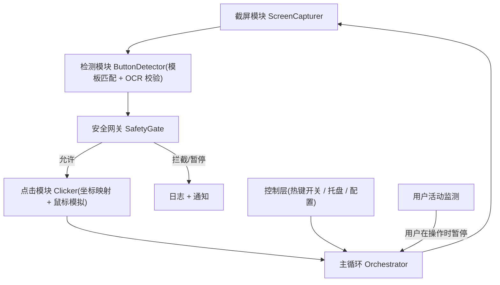

# Cursor 自动确认助手 — 技术规格文档 (SPEC)

> 代号: **CursorAutoPilot**
> 版本: v0.1 (草案)
> 平台: Windows 10/11 (win32 10.0.26200)
> 技术栈: Python 3.11+
> 路线: 桌面图像识别为主体 + 高星项目安全机制 (危险命令拦截 / 死循环检测)

---

## 1. 背景与目标

### 1.1 问题描述
在使用 Cursor 时，Agent 经常停在需要用户手动确认的按钮上（如 `Accept` / `Accept All` / `Keep` / `Keep All` / `Run` / `Resume` / `Continue` / `Try Again`），导致流程被阻塞。用户多数情况下都是直接通过，但又无法长时间盯着屏幕手动点击。

### 1.2 项目目标
做一个**桌面自动化工具**：周期性扫描屏幕 → 识别 Cursor 上的确认类按钮 → 自动点击它，让 Agent 在无人值守时也能持续推进；同时通过安全机制避免"自动点了不该点的东西"（尤其是危险终端命令）。

### 1.3 非目标 (Out of Scope, v0.1)
- 不做跨平台 (macOS/Linux 留待 v0.2)。
- 不做 Cursor 之外的 IDE（Windsurf/Antigravity 等留待后续）。
- 不修改 Cursor 内部、不注入进程；纯外部"看屏幕 + 点鼠标"。

---

## 2. 技术路线与架构

### 2.1 路线选择
采用**混合路线**：
- **主体 = 桌面图像识别**：截屏 → 模板匹配 (OpenCV) 定位按钮 → OCR 兜底校验文字 → 模拟鼠标点击。通用、不依赖 Cursor 内部接口。
- **安全机制借鉴高星项目**（`nockasdd/domyh-auto-accept`、`mstrvndev/auto-accept-agent`）：危险命令拦截、死循环 (death loop) 检测、按钮白/黑名单、下拉菜单保护。

### 2.2 架构图



### 2.3 核心模块
- `ScreenCapturer`: 抓取目标显示器/区域截图（`mss`）。
- `ButtonDetector`: 模板匹配 (`opencv`) 找候选按钮；`OCR` (`RapidOCR`/`pytesseract`) 校验按钮文字，降低误点。
- `SafetyGate`: 命中"Run/终端命令"类按钮时，先 OCR 读取按钮附近的命令文本，匹配危险模式则拦截；死循环检测；白/黑名单。
- `Clicker`: 屏幕坐标 → 物理坐标映射（处理多显示器与 DPI 缩放），`pyautogui`/`pydirectinput` 模拟点击。
- `Orchestrator`: 主循环、节流、状态机。
- `Control`: 全局热键 (`keyboard`) 启停、系统托盘图标 (`pystray`)、状态展示。
- `Config`: `config.yaml` 集中配置（扫描间隔、启用的按钮类型、安全规则、显示器选择）。

### 2.4 目录结构（建议）
```
自动点击/
├─ SPEC.md
├─ README.md
├─ requirements.txt
├─ config.yaml
├─ assets/templates/        # 各按钮模板图 (Accept.png, Run.png ...)
├─ src/
│  ├─ main.py               # 入口 + Orchestrator
│  ├─ capture.py            # ScreenCapturer
│  ├─ detector.py           # ButtonDetector
│  ├─ safety.py             # SafetyGate (危险命令/死循环)
│  ├─ clicker.py            # Clicker (坐标映射)
│  ├─ control.py            # 热键/托盘
│  └─ config.py             # 配置加载
└─ tests/
   ├─ fixtures/             # 标注好的截图样本集
   └─ test_*.py
```

### 2.5 失焦点击需求（关键）
实测表明：用户切到其他 App、Cursor 不在前台时，`Accept` 等确认按钮仍会弹出。工具必须满足：
- **全屏常驻扫描**：检测不依赖 Cursor 为前台窗口，主循环始终对目标显示器全屏扫描。
- **失焦点击**：能在不打断用户当前前台应用的前提下点击该按钮。两种实现策略，按稳定性择优：
  1. 优先尝试**不抢焦点**的点击（如向 Cursor 窗口投递点击消息 / 后台坐标点击）；
  2. 若必须激活窗口，则**点击后立即把焦点还给用户原前台窗口**，最小化干扰。
- **不与用户抢操作**：仅在用户近 N 秒无鼠标/键盘活动时执行点击（与 §4 阶段 5 的用户让位逻辑联动）。

---

## 3. 总体成功标准 (项目级验收 KPI)

整个项目在 **30 分钟真实 Cursor 使用回放/实测** 中，需同时满足下表所有指标，方视为"成功"：

- **检测召回率 (Recall) ≥ 95%**：屏幕上出现的目标按钮，被检测到的比例。
- **点击准确率 (Precision) ≥ 99%**：所有自动点击中，点中正确目标的比例（点错按钮属严重缺陷）。
- **误点击率 (False Click) ≤ 0.5 次 / 小时**：点到非目标区域的次数。
- **危险命令拦截率 = 100%**：测试集中的危险命令（见 §5）必须 100% 被拦截，0 误放行。
- **响应时延 ≤ 2 s**：按钮出现到完成点击的中位时延。
- **死循环防护**：同一按钮在 N 秒内重复出现并被点击超过阈值时，自动暂停并告警，零无限循环。
- **资源占用**：空闲态 CPU 平均 ≤ 5%（单核），内存 ≤ 200 MB。
- **可控性**：热键可在 200 ms 内启停；用户手动操作鼠标/键盘时自动让位（暂停）。

> 度量方法：用 §6 的标注样本集做离线评测（Precision/Recall/拦截率），用实测会话做时延与资源/可控性验证。

---

## 4. 分阶段实现与每阶段验证指标

每个阶段都有明确**交付物**和可量化的**验收指标 (Definition of Done)**。未达标不进入下一阶段。

### 阶段 0 — 项目脚手架与环境
- **交付物**: 目录结构、`requirements.txt`、`config.yaml` 样例、可运行的"Hello loop"（每秒打印一次心跳，热键可停）。
- **验证指标**:
  - [ ] `pip install -r requirements.txt` 在干净环境一次成功。
  - [ ] 程序可启动并以固定间隔输出心跳日志，按热键能正常退出（退出码 0）。

### 阶段 1 — 截屏 (ScreenCapturer)
- **交付物**: 抓取指定显示器全屏/区域截图，输出为可供检测的图像。
- **验证指标**:
  - [ ] 多显示器环境下能正确截取**指定**显示器，截图分辨率与系统设置一致。
  - [ ] 连续截屏帧率 ≥ 10 FPS，单帧耗时 ≤ 50 ms。
  - [ ] 在 125%/150% DPI 缩放下截图无裁切/拉伸错误（与实际像素一致）。

### 阶段 2 — 按钮检测 (ButtonDetector，核心)
- **交付物**: 基于模板匹配返回候选按钮的 `{类型, 包围框, 匹配度}`；支持多按钮类型。
- **验证指标**（在 §6 标注样本集上离线评测）:
  - [ ] 单类按钮 (Accept) **召回率 ≥ 95%**、**准确率 ≥ 99%**。
  - [ ] 全部按钮类型整体 **召回率 ≥ 90%**、**准确率 ≥ 98%**。
  - [ ] 单帧检测耗时 ≤ 100 ms。
  - [ ] 对明亮/暗色主题各跑一遍，指标均达标（验证主题鲁棒性）。

### 阶段 3 — 点击执行 (Clicker，坐标映射)
- **交付物**: 把检测到的按钮中心点正确映射为物理屏幕坐标并点击。
- **验证指标**:
  - [ ] 在 100%/125%/150% 三种 DPI 下，点击落点与按钮中心偏差 ≤ 3 px。
  - [ ] 多显示器（主屏右侧/左侧/上方排列）下点击坐标均正确。
  - [ ] 端到端（出现→点中）中位时延 ≤ 2 s，P95 ≤ 3 s。
  - [ ] 100 次自动点击中，点错位置 = 0 次。
  - [ ] **失焦点击**：当 Cursor 不在前台（用户停留在其他 App）时，仍能成功点中弹出的 `Accept` 按钮，成功率 ≥ 95%；点击后用户原前台窗口的焦点不被永久夺走（≤ 200 ms 内归还或全程不抢焦点）。

### 阶段 4 — 安全网关 (SafetyGate)
- **交付物**: 危险命令拦截 + 死循环检测 + 按钮白/黑名单 + 下拉菜单保护。
- **验证指标**:
  - [ ] 危险命令测试集（§5）**拦截率 = 100%**，安全命令测试集**误拦率 ≤ 2%**。
  - [ ] 死循环：构造"同一按钮反复出现"场景，系统在阈值（如 60 s 内点击 ≥ 5 次同位置同类型）触发暂停并告警，**零无限循环**。
  - [ ] 黑名单中的按钮类型（如 `Reject`/下拉箭头）**永不被点击**。
  - [ ] 所有拦截/暂停事件均写入日志，可追溯原因。

### 阶段 5 — 控制层与用户让位 (Control)
- **交付物**: 全局热键启停、系统托盘状态图标、用户活动检测（用户操作时自动暂停）。
- **验证指标**:
  - [ ] 全局热键（如 `Ctrl+Alt+A`）在任意前台窗口下都能启停，响应 ≤ 200 ms。
  - [ ] 托盘图标实时反映 `运行中 / 已暂停` 状态。
  - [ ] 检测到用户在 2 s 内有鼠标/键盘活动时，自动暂停自动点击，避免与用户抢操作。

### 阶段 6 — 鲁棒性与自检 (Robustness)
- **交付物**: OCR 兜底校验、模板缺失/匹配低分时的降级策略、启动自检。
- **验证指标**:
  - [ ] 当模板匹配分数处于临界区间时，触发 OCR 二次校验，整体误点击率较纯模板下降 ≥ 50%。
  - [ ] 启动自检：检测显示器、模板文件、依赖是否就绪，缺失时给出明确提示而非崩溃。
  - [ ] 30 分钟连续运行无崩溃、无内存泄漏（内存增长 ≤ 20 MB）。

### 阶段 7 — 打包与文档 (Release)
- **交付物**: `README.md`（安装/配置/使用/安全说明）、一键运行脚本、可选 PyInstaller 打包。
- **验证指标**:
  - [ ] 全新机器按 README 步骤可在 10 分钟内跑起来。
  - [ ] 打包后的 exe 可独立运行，覆盖 §3 的核心 KPI。

---

## 5. 安全规则（危险命令拦截清单 / 测试集）

`SafetyGate` 在点击 `Run`/终端命令类按钮前，OCR 读取命令文本，命中以下模式则**拦截并告警**（默认黑名单，可在 `config.yaml` 扩展）：

- 删除类: `rm -rf`, `del /s`, `rmdir /s`, `format`, `mkfs`, `Remove-Item -Recurse -Force`
- 磁盘/分区: `format C:`, `diskpart`, `dd if=`, `> /dev/sda`
- 提权/系统: `shutdown`, `reboot`, `:(){ :|:& };:`（fork 炸弹）, `chmod -R 777 /`
- 管道执行: `curl ... | sh`, `iwr ... | iex`, `wget ... | bash`
- 凭据/密钥外泄: 含 `AKIA`, `BEGIN PRIVATE KEY`, `.ssh/id_` 等
- 网络批量操作: `git push --force`（可配置为需确认）

**测试集要求**：危险样本 ≥ 30 条（拦截率必须 100%），安全样本 ≥ 50 条（误拦率 ≤ 2%）。

---

## 6. 评测样本集 (Ground Truth)

- 收集 ≥ 200 张真实 Cursor 截图，覆盖：明/暗主题、不同窗口大小、按钮在不同位置、有/无按钮、**附录 A 中全部按钮类型**。
- 每张图标注：按钮类型 + 包围框坐标。
- 用于阶段 2/4 的离线 Precision/Recall/拦截率自动评测（`pytest`），保证指标可复现、回归不退化。

---

## 7. 关键风险与对策

- **Cursor UI 改版导致按钮样式变化** → 模板可热更新 + OCR 兜底（按文字识别，弱依赖像素外观）。
- **分辨率/DPI/主题差异** → 阶段 1/3 专项验证；模板按主题分组；坐标映射统一处理 DPI。
- **误点危险操作** → SafetyGate 强制前置校验，危险命令拦截率作为硬性 100% 指标。
- **与用户抢鼠标** → 用户活动检测自动让位 + 全局热键随时叫停。
- **图像识别天然脆弱** → 保留升级到"CDP/扩展路线"的接口（`detector` 可替换实现），后续可平滑切换到更稳的网页层方案。

---

## 8. 参考项目 (GitHub 高关注度)

- [`nockasdd/domyh-auto-accept`](https://github.com/nockasdd/domyh-auto-accept) — 多 IDE 自动接受，含危险命令拦截、死循环防护、定时调度（CDP 路线，安全机制可借鉴）。
- [`mstrvndev/auto-accept-agent-antigravity-free`](https://github.com/mstrvndev/auto-accept-agent-antigravity-free) — CDP + 轮询自动点击，含浏览器控制。
- Cursor 原生能力（可作为对照/兜底）：`Settings > Agents > Auto-Run`(Run Everything)、`Auto-review` 模式、`Inline Diffs` 开关。

---

## 附录 A — Cursor 确认按钮全清单（实测调研）

> 来源：Cursor 官方文档/社区论坛（官方确认终端审批按钮为 `Run / Skip / Allowlist`）+ 高星自动接受项目支持列表（`domyh-auto-accept` / `auto-accept-agent`）。
> Cursor 版本迭代较快、按钮文案会变（如旧版 `Accept` → 新版 `Keep`），实现时以 OCR 文字 + 模板双重匹配，并支持在 `config.yaml` 增改条目。

**统计概览**：需要用户确认的按钮共归为 **5 大类、约 19 种**；其中**应自动点击的目标按钮 13 种**，**必须保护/不点的 6 种**。

> **重要（实测）**：即使用户切换到其他 App、Cursor 不在前台/已失焦时，`Accept` 等确认按钮仍会弹出。因此工具**不能只在 Cursor 为前台窗口时工作**，必须全屏扫描、在任意前台应用下都能识别并点击（见 §2.5 失焦点击需求）。

### A.1 代码编辑 / Diff 应用类（点击 = 接受改动）
| 按钮 | 出现场景 | 默认动作 |
| --- | --- | --- |
| `Accept` | 接受单个文件/单处改动（旧版命名） | 点击 |
| `Accept All` | 接受全部改动 | 点击 |
| `Keep` | 保留单个文件改动（新版命名） | 点击 |
| `Keep All` | 保留全部改动 | 点击 |
| `Reject` / `Reject All` | 拒绝改动 | 忽略（不点，留给用户） |
| `Undo` | 撤销已应用改动 | 忽略 |

### A.2 终端命令 / 工具调用审批类（点击前必须过 SafetyGate）
| 按钮 | 出现场景 | 默认动作 |
| --- | --- | --- |
| `Run` | 执行 Agent 请求的终端命令 | 点击（先做危险命令校验 §5） |
| `Run in background` / `Move to background` | 长任务后台执行 | 点击（默认开启） |
| `Approve` | 新版工具调用批准 | 点击（过 SafetyGate） |
| `Accept`（MCP/工具调用） | MCP / 工具调用确认 | 点击（过 SafetyGate） |
| `Skip` | 跳过该命令 | 忽略 |
| `Reject` / `Deny` | 拒绝命令 | 忽略 |

### A.3 Agent 流程控制类（点击 = 让流程继续）
| 按钮 | 出现场景 | 默认动作 |
| --- | --- | --- |
| `Continue` | 对话过长 / 网页搜索继续 / "已运行较久"提示 | 点击 |
| `Resume` | 恢复被中断的会话 / 恢复对话 | 点击 |
| `Try Again` / `Retry` | 出错后重试 | 点击（受死循环防护约束） |
| `Proceed` | 继续进行 | 点击 |
| `Continue generating` / `Generate` | 达到长度上限继续生成 | 点击 |

### A.4 弹窗 / 错误处理类
| 元素 | 出现场景 | 默认动作 |
| --- | --- | --- |
| 错误弹窗（usage limit / network error） | 用量限制 / 网络错误提示 | 关闭弹窗，可选重发上条消息 |

### A.5 黑名单 / 保护（绝不自动点击）
| 元素 | 原因 |
| --- | --- |
| `Use Allowlist` / `Add to Allowlist` | 会修改信任配置，误点风险高 |
| `Ask Every Time` | 下拉选项，非确认动作 |
| 下拉箭头 / dropdown 菜单 | 误触会展开/切换模式 |
| `Reject` / `Reject All` / `Deny` / `Undo` | 属用户决定的否定/撤销操作 |

> 注意：A.2 中的 `Run`/`Approve`/`Accept(MCP)` 命中危险命令时由 SafetyGate 拦截；`Try Again`/`Retry` 由死循环检测约束，避免在持续报错时无限重试。

---

## 9. 依赖清单 (初稿)

```
mss            # 高速截屏
opencv-python  # 模板匹配
numpy
rapidocr-onnxruntime  # OCR (轻量，免装 Tesseract)
pyautogui      # 鼠标点击 (或 pydirectinput)
keyboard       # 全局热键
pystray        # 系统托盘
pillow         # 图像处理
pyyaml         # 配置
pytest         # 测试与评测
```
